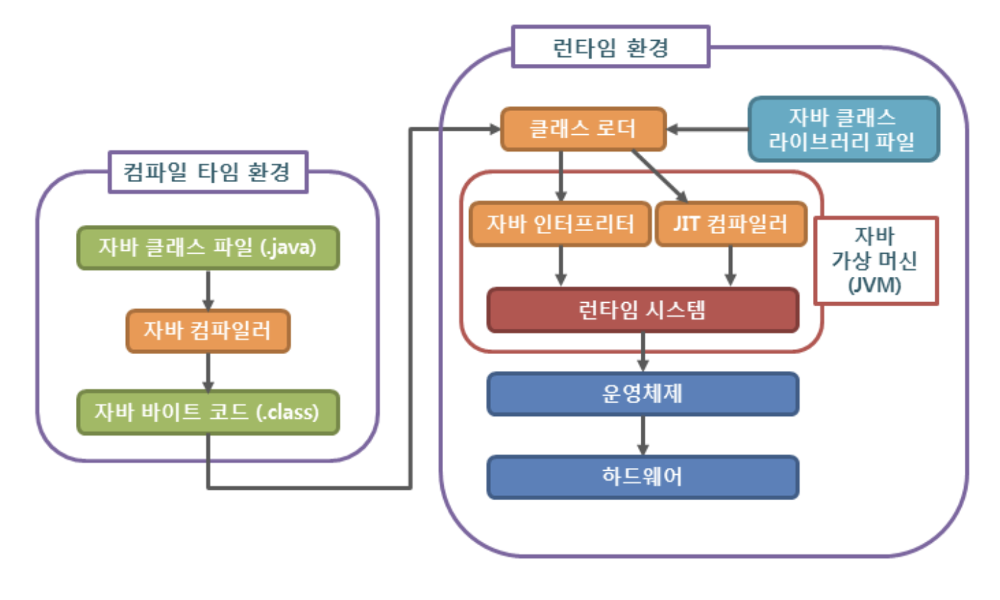
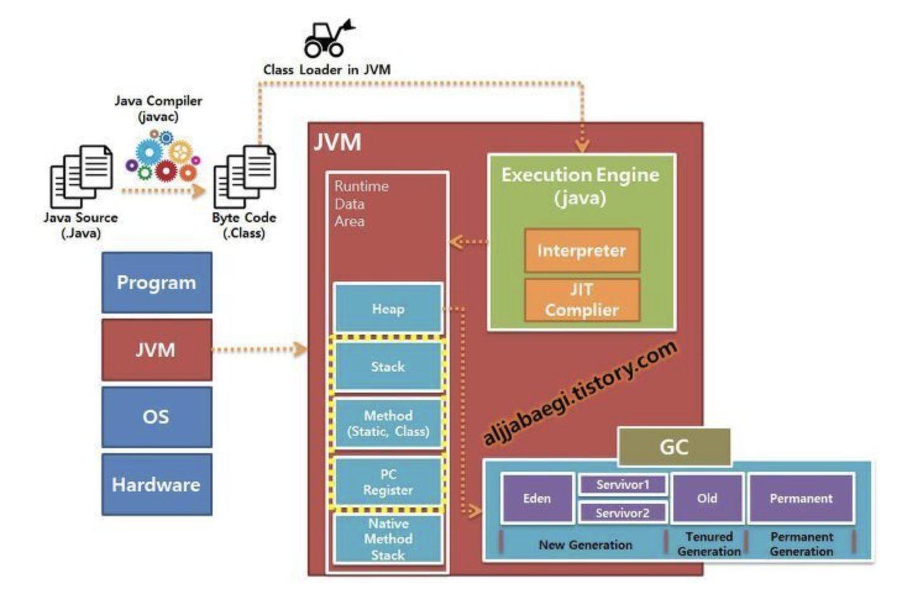
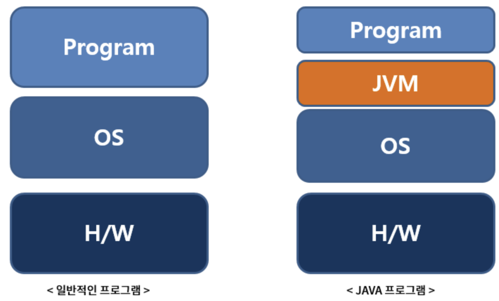

# **GettingStarted**

_자바를 학습하기 전 탄생 배경과 환경 설정에 대해 학습합니다_

## **contents**

- [Java 컴파일 과정](#java-컴파일-과정)
- [JVM](#jvm)
- [Java의 특징](#java의-특징)

## **Java 컴파일 과정**



1. 개발자가 자바 소스코드(.java)를 작성

2. 자바 컴파일러(javac)가 자바 소스코드(.java)파일을 읽어 바이트코드(.class)코드로 컴파일

`바이트코드`

```
바이트코드 파일은 자바 가상 머신이 이해할 수 있는 언어로 변환된 자바 소스 코드를 의미합니다

자바 컴파일러에 의해 변환되는 코드의 명령어 크기가 1바이트라서 자바 바이트 코드라고 합니다

확장자 : .class
```



3. 컴파일된 바이트코드(.class)를 JVM의 클래스로더(Class Loader)에게 전달

4. 클래스 로더는 동작로딩(Dynamic Loading)을 통해 필요한 클래스들을 로딩 및 링크하여 런타임 데이터영역(Runtime Data Area), 즉 JVM 메모리에 올림

`클래스 로더 세부 동작`

```
1. 로드 : 클래스 파일을 가져와서 JVM 메모리에 로드한다

2. 검증 : 자바 언어 명세(Java Language Specification) 및 JVM 명세에 명시된 대로 구성되어있는지 검사한다

3. 준비 : 클래스가 필요로 하는 메모리를 할당한다(필드, 메서드, 인터페이스...)

4. 분석 : 클래스의 상수 풀 내 모든 심볼릭 레퍼런스를 다이렉트 레퍼런스로 변경한다

5. 초기화 : 클래스 변수들은 적절한 값으로 초기화한다
```

5. 실행엔진(Execution Engine)은 JVM 메모리에 올라온 바이트 코드들을 명령어 단위로 하나씩 가져와 실행

실행 엔진은 두가지 방식으로 변경한다

```
1. 인터프리터: 바이트코드 명령어를 하나씩 읽어서 해석하고 실행

하나하나의 실행은 빠르나, 전체적인 실행 속도가 느리다

2. JIT 컴파일러: 인터프리터의 단점을 보완하기 위해 도입된 방식으로

바이트 코드 전체를 컴파일하여 바이너리 코드로 변경하고

이후에는 해당 메서드를 더이상 인터프리팅 하지않고 바이너리 코드로 직접 실행하는 방식

전체적인 실행 속도가 인터프리팅 방식보다 빨라진다
```

[세부적인 참고 자료](https://steady-snail.tistory.com/67)

<div align = "right">
	<b><a href = "#Contents">↥ top</a></b>
</div>

## **JVM**

쉽게말해 컴파일된 코드(바이트코드)를 실행시켜주는 가상의 컴퓨터를 말한다

바이트 코드로 변환된 코드를 클래스 로더가 JVM의 메모리에 올리면 JVM의 실행엔진인 인터프리터나 JIT 컴파일러가 해석하고 실행하는 역할을 한다

즉, JVM은 다른 프로그램을 실행시키는 것이 목적으로

1. 자바 프로그램이 어느 기기나 운영체제 상에서도 실행될 수 있도록 하고
2. 프로그램 메모리를 관리하고 최적화 한다

<div align = "right">
	<b><a href = "#Contents">↥ top</a></b>
</div>

## **Java의 특징**



<!--  -->

일반 애플리케이션은 OS만 거치고 H/W로 전달되지만,

자바 애플리케이션은 H/W와 OS 위에 JVM이 있다

또한 하드웨어에 맞게 완전히 컴파일된 상태가 아니기 때문에

실행 시 해석되므로 속도가 느리다

그러나 Java 애플리케이션은 어느 OS와도 독립적이기 때문에

OS 환경을 고려하지 않아도 수정없이 실행 가능하다는 장점이 있다

JVM은 OS에 종속적이므로 해당 OS에서 실행 가능한 JVM이 필요하다

1. 운영체제에 독립적

   JVM을 통해 가능한 것으로, 자바 응용프로그램은 운영체제나 하드웨어가 아닌

   JVM 하고만 통신하고 JVM이 자바 응용프로그램으로부터 전달받은 명령을

   해당 운영체제가 이해할 수 있도록 변환하여 전달한다

   어느 하드웨어던, 어느 운영체제던 상관없이 컴파일된 코드가 독립적이라는 뜻이다

   ```
   가전제품 내에 탑재해 동작하는 프로그램을 개발하려고 하는데

   당시 유닉스 기반의 배경을 가지고 있었기에 C++의 특성상 여러 하드웨어를 커버하기에는

   각각의 하드웨어에 맞게 소스를 작성해야하는 번거로움이 있어 JAVA를 개발하게 되었다
   ```

   _쉽게말해 어느 플랫폼이든 작성한 소스를 다 실행시킬 수 있다_

2. 객체지향언어

   객체지향개념의 특징인 상속, 캡슐화, 다형성이 잘 적용된 순수 객체지향 언어

3. 파생 배경

   자바의 연산자와 기본 구문은 C++에서,

   객체지향관련 구문은 스몰톡이라는 객체지향언어에서 왔다

4. 자동 메모리 관리(Garbage Collection)

   자바로 작성된 프로그램이 실행되면, 가비지컬렉터가 자동적으로 메모리를 관리해주므로

   메모리를 따로 관리하지 않아도 된다

5. 네트워크와 분산처리를 지원

   인터넷과 대규모 분산환경을 염두에 두어

   풍부하고 다양한 프로그래밍 라이브러리(Java API)를 통해

   비교적 짧은 시간에 네트워크 관련 프로그램을 쉽게 개발할 수 있도록 지원한다

6. 멀티쓰레드를 지원

   일반적으로 멀티쓰레드의 지원은 OS에 따라 구현, 처리 방식이 다르다

   자바에서 개발되는 멀티쓰레드 프로그램은 시스템과 관계없이 구현 가능하며

   관련 리이브러리(Java API)가 제공되므로 구현이 쉽다

   그리고 여러 쓰레드에 대한 스케줄링을 자바 인터프리터가 담당한다

7. 동적 로딩을 지원

   보통 자바로 작성된 애플리케이션은 여러 개의 클래스로 구성되어 있다

   자바는 동적 로딩을 지원하기 때문에 실행 시 모든 클래스가 로딩되지 않고

   필요한 시점에 클래스를 로딩하여 사용할 수 있다는 장점이 있다

   그 외에도 일부 클래스가 변경되어도 전체 애플래키에션을 다시 컴파일 하지 않아도 되며

   변경사항이 발생해도 적은 작업만으로도 처리할 수 있는 유연한 어플리케이션을 작성할 수 있다

<div align = "right">
	<b><a href = "#Contents">↥ top</a></b>
</div>
