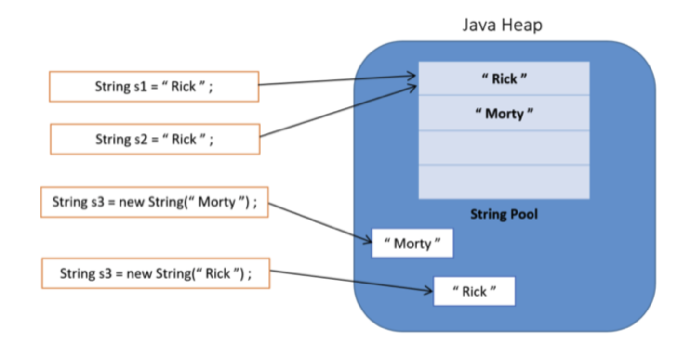
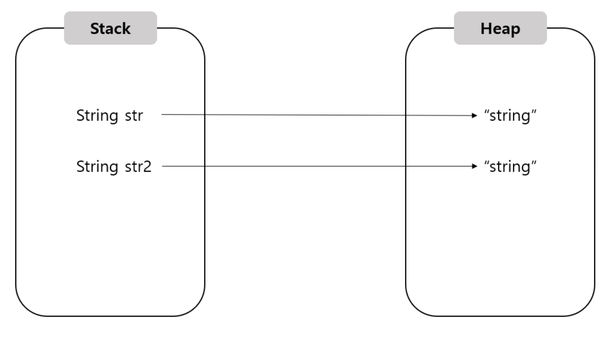
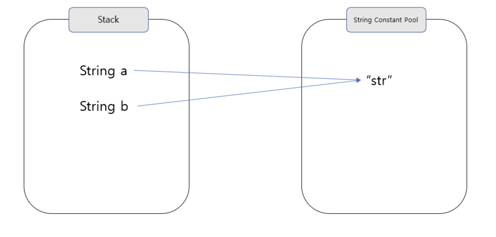
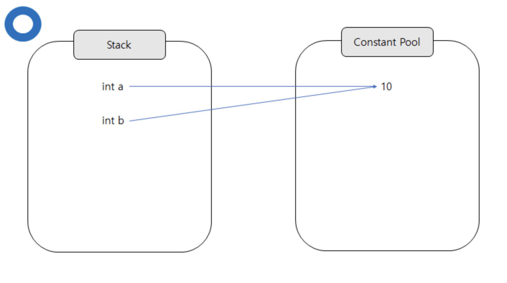
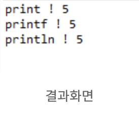

# **Variable**

_변수에 대해 학습합니다_

## **변수의 명명규칙**

`변수의 이름`처럼 프로그래밍에서 사용하는 모든 이름을 `식별자`라 합니다

식별자는 다음과 같은 규칙을 가집니다

```
1. 대,소문자가 구분되며 길이에 제한이 없다

2. 예약어를 사용해서는 안 된다

3. 숫자로 시작하면 안 된다

4. 특수문자는 '_'와 '$'만을 허용한다
```

[예약어에 대하여](https://vaert.tistory.com/106)

권장 규칙은 다음과 같습니다

```
1. 클래스의 이름 첫 글자는 항상 대문자로 한다

2. 여러 단어로 이루어진 이름은 단어 첫 글자를 대문자로 한다

3. 상수의 이름은 모두 대문자로 하고, 여러 단어의 경우 `_`로 구분한다
```

## **기본형과 참조형**

- 기본형

  실제 값을 저장한다

  boolean, char, byte, short, int, long, float, double

- 참조형

  객체의 주소를 저장한다

참조변수를 선언할 때는 변수의 타입으로 클래스의 이름을 사용한다

즉 클래스의 이름이 참조변수의 타입이 된다

새로운 클래스를 작성한다는 것은 새로운 참조형을 추가하는 셈이다

## **String**

String은 java에서 제공하는 특별한 자료형이다

String을 생성하기 위한 방법으로,

1. "..." Literal을 이용하는 방법

2. new 연산자를 통해 String 객체의 생성자로 value 주입

이 있다

자바에서 모든 String은 `constant 형태`로

`한 번 생성이 된다면 update 라는 개념이 사라진다`

- Java에서 String은 immutable 하다

_값을 수정한다면 새로운 객체를 생성하고 그 값을 재할당 해야한다_

    이유 1 : `캐싱`

    JVM이 String Constant Pool 이라는 영역을 만드는데,

    문자열들을 constant화 하여 다른 변수 혹은 객체들과 공유한다

    이 과정에서 데이터 캐싱이 일어나고 성능적 이득을 취할 수 있다

    이유 2 : `동기화`

    immutable 하다면 멀티쓰레드 환경에서 동기화 문제가 발생하지 않는다

    즉 더욱 safe한 결과를 낼 수 있다

    이유 3 : `보안적 이유`

    mutable 하다면 특정 공격 벡터에 의해 integrity한 데이터가 아니게 될 수 있다고 한다

## String Constant Pool

_앞서 말한대로 String은 constant pool을 사용한다_



String은 한번 사용되면 또다시 재사용될 확률이 높다

이러한 대처 방법으로 heap 영역 내에 문자열 상수의 Pool을 유지하고

해당 Pool로 사용자가 정의한 변수가 가지고 있는 값을 담게 된다

이 과정에서 String value들이 immutable한 특성을 가지고

constant pool이 있어 위 장점들을 얻을 수 있다

`literal을 이용한 방법으로만 String constant pool을 이용할 수 있다`

[참조 자료](https://wonit.tistory.com/588)

## **new 연산자**

객체를 Heap이라는 메모리 영역에 메모리 공간을 할당하고

메모리주소를 반환한 후 생성자를 실행시켜준다

리터럴과 다르게 new 연산자로 생성된 객체는

똑같은 값을 가진 객체가 있어도 서로 다른 메모리를 할당하므로

서로 다른 객체로 분류된다

[메모리 현황]

```java
public class Main {

	public static void main(String[] args) {
		String str = new String("string");
		String str2 = new String("string");

		System.out.println(System.identityHashCode(str)); 	//result:2008362258
		System.out.println(System.identityHashCode(str2));	//result:760563749
        // 메모리주소가 서로 다르게 찍히는 것을 볼 수 있다
	}
}
```



`System.identityHashCode()` : 메모리 주소를 숫자값으로 반환해주는 메서드

## String literal, 즉 큰 따옴표를 사용하기

[리터럴 방식과 비교]

```java
public class Main {

	public static void main(String[] args) {
		String a = "str";
		String b = "str";

		System.out.println(System.identityHashCode(a));	//result:2008362258
		System.out.println(System.identityHashCode(b)); //result:2008362258
	}
}
```



- new 연산자 방식과 literal 방식의 차이

  new 연산자는 heap 메모리 영역에 각각 할당한다

  리터럴 방식은 동일한 메모리 주소를 가리킨다

  String literal로 생성하면 String 값은

  Heap 영역 내 `"String Constant Pool"`에 저장된다

  new 연산자는 같은 내용이더라도 (Stack 영역에 있는)여러 개의 객체가 각각 Heap 영역을 차지한다

## **리터럴**

변하지 않는 데이터 그 자체를 의미한다

```java
int a = 10;
int b = 10;
```



위의 10과 같이 변하지 않는 고정적인 값을 리터럴이라 부른다

java에서는 위의 10 값도 Heap 영역의 `Constant Pool`에 할당이 된다

즉, stack의 a와 b는 동일한 10을 가리키게 된다

[참조 자료](https://yoo11052.tistory.com/50)

## 출력

- `print()`

  괄호안 내용을 단순히 출력

  개행문자 포함 안됨

- `printf()`

  C에서 printf와 동일

- `println()`

  괄호안 내용을 출력한 후 마지막에 개행 문자가 포함되어 있음

```java
public class ThreadTest extends Thread{
	public static void main(String[] args) {
		int num = 5;
		System.out.print("print ! " + num + "\n");	//print
		System.out.printf("printf ! %d \n", num);	//printf
		System.out.println("println ! " + num);		//println
	}
}
```



## 입력

- Scanner

  ```java
  import java.util.*

  Scanner scanner = new Scanner(System.in);
  // Scanner 클래스 객체생성

  String input = scanner.nextLine();
  // 입력받은 내용을 input에 저장
  int num = Integer.parseInt(input);
  // 입력받은 내용을 input 타입의 값으로 변환
  ```

  바로 int를 입력받고 싶은 경우

  ```java
  int num = scanner.nextInt();
  // 정수를 입력받아서 변수 num에 저장
  ```

  그러나 화면에서 연속적으로 값을 입력받아 사용하기 까다롭기 때문에

  모든 값을 nextLine()으로 받는 것이 좋다
