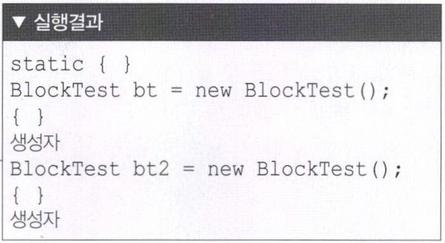

# 객체 지향 프로그래밍

## 객체 (Object)

_구체적이거나 추상적인 (어떤 기능을 수행하는) 데이터의 단위_

여러가지 명사들 (통계, 생산, 주문, 배송...)

눈에 보이는 물체가 아닌 동작을 나타내는...

## 절차 지향 프로그래밍과의 비교

_C언어_

시간이나 사건의 흐름에 따른 프로그래밍

```
일어난다 -> 씻는다 -> 밥을 먹는다 -> 버스를 탄다...
```

객체 지향 프로그래밍 관점에서 보자면

```
학생, 밥, 버스, 학교 객체를 생성한다

객체간의 협력이 발생

학생(지출) <-(탄다)-> 버스(승객의 증감, 매출이 발생)
```

우리도 하나의 객체기 때문에

객체 지향 프로그래밍이 실시간을 더 잘 반영한다


-   객체 지향 프로그램은 어떻게 구현하는가?

    객체를 정의하고

    각 객체 제공하는 기능들을 구현하고

    각 객체가 제공하는 기능들 간의 소통(메세지 전달)을 통해 객체간의 협력을 구현
    ```
    메세지 전달 == 파라미터를 전달
    ```

## 생활 속에서 `객체` 찾아 클래스로 구현해 보기

- 온라인 쇼핑몰에 `회원` 로그인을 하고 여러 `판매자`가 판매하는 `제품` 중 하나를 골라 `주문`을 한다

- `회사`에 가는 길에 `커피숍`에 들려 `아아`를 주문했다


_해당 객체를 추상화 해서 코딩하는 것_

- 학생 클래스
    ```java
    public class Student {

        int studentNum;
        String studentName;
        int majorCode;
        String majorName;
        int grade;
    }
    // 속성들을 안에 선언하는 이것들을 `멤버변수` 라고 한다
    ```
    _member vairable_

- 주문 클래스
    ```java
    public class Student {

        int orderId;
        String buyerId;
        String SellerId;
        int productId;
        String orderDate;
    }
    ```

객체 지향 프로그램을 할 때는

1. 객체를 정의하고 (class를 만들고)
2. 각 객체의 속성을 멤버 변수로 역할을 메서드로 구현하고
3. 각 객체간의 협력을 구현한다

클래스 코딩할 때
1. 클래스는 대문자로 시작하는 것이 좋고
2. java 파일 하나에 클래스 여러개 있을 수 있다
3. 그러나 public 클래스는 하나이며 .java 파일 이름은 동일하다
4. camel notaion 방식 명명

## 함수와 메서드

- 함수

    하나의 기능을 수행하는 일련의 코드

    구현된 함수는 호출하여 사용

    호출된 함수는 기능이 끝나면 제어가 반환됨
    
    함수로 구현된 하나의 기능은 여러 곳에서 동일한 방식으로 호출 사용이 가능

- 메서드

    객체의 기능을 구현하기 위해 클래스 내부에 구현되는 함수

    함수는 어디에 속해있는 것이 아니다

    메서드는 class 안에 속해있다

    그 class 안에 멤버 변수들을 활용해서 구현되었다

    C++에서는 `멤버 함수`라고 부른다

    메서드의 이름은 그 객체를 사용하는 객체에 맞게 짓는것이 좋다 

    ex) getStudentName()

실습

## 인스턴스 생성과 힙 메모리

- 인스턴스 (instance)

    클래스는 객체의 속성을 정의하고 기능을 구현하여 만들어 놓은 코드 상태

    실제 클래스 기반으로 생성된 인스턴스는 각각 다른 멤버 변수 값을 가지게 됨

    new 키워드를 사용하여 인스턴스를 생성

```
new 키워드를 통해 만들어진 인스턴스는 동적메모리 Heap에 생성된다

cf 1. C -> malloc / free
cf 2. C++ -> new / delete
```

```java
package ch04;

public class StudentTest {

	public static void main(String[] args) {
		Student studentLee = new Student();

    // student 타입의
    // studentLee 변수가 선언

    // 이 변수가 new 해서 어떤 값을 할당 받았음
    // System.out.println(studentLee); 
    //       >> ch04.Student@36aa7bc2
    // package, class 이름 (class full name)@ 주소
    // 36aa7bc2는 heap에 자리잡은 주소를 말한다
    // 실제 물리적인 주소가 아니라 JVM이 준 가상 address
    // studentLee는 stack에 쌓인 변수고
    // JVM에 의해 할당받은 인스턴스 동적 메모리 주소 이름이 36aa7bc2

    // studentLee == 참조변수
    // 36aa7bc2 == 참조 값
	}

}

```
- 용어 정리

    객체 : 객체 지향 프로그램의 대상, 생성된 인스턴스

    클래스 : 객체를 프로그래밍 하기위해 코드로 정의해 놓은 상태

    인스턴스 : new 키워드를 사용하여 클래스를 메모리에 생성한 상태

    멤버 변수 : 클래스의 속성, 특성

    메서드 : 멤버 변수를 이용하여 클래스의 기능을 구현한 함수

    참조 변수 : 메모리에 생성된 인스턴스를 가리키는 변수

    참조 값 : 생성된 인스턴스의 메모리 주소 값

## 생성자

인스턴스를 생성할 때 

```java
"클래스 객체변수 = new 클래스();"
```

 라는 구문을 사용하고 이때 `"클래스();"`는 생성자를 호출하는 의미이다

생성자는 new 연산자를 통해서 인스턴스를 생성할 때 반드시 호출이 되고 

제일 먼저 실행되는 일종의 메소드(하지만 메소드와는 다르다.)이다.

```
1. 생성자의 이름은 클래스의 이름과 같아야 한다

2. 생성자는 리턴 값이 없다

3. 모든 생성자는 리턴 값이 없으므로 void를 붙이지 않는다
```

인스턴스 변수(필드 값 등)를 초기화 시키는 역할을 한다. 

- 생성자 선언 방법
    ```java
    public class(매개변수){
            ...
        }
    ```


생성자가 하나도 만들어지지 않으면 기본 생성자(default constructor) 가 만들어진다

```java
<class_name>([argument_list]) {<statements};
```

객체를 생성할 때 new 키워드와 함께 사용

```java
new Student();
```

일반 함수처럼 기능을 호출하는 것이 아니고,

객체를 생성하기 위해 new와 함께 호출됨

>> 연산자 new가 인스턴스를 생성하는 것이지<br>
>> 생성자가 인스턴스를 생성하는 것이 아니다

_생성자는 인스턴스 변수들의 초기화에 사용되는 특별한 메서드일 뿐이다_


생성자는 외부에서 접근 가능하지만 private 선언되는 경우도 있음

```java
Card c = new Card();

1. new에 의해 힙 메모리에 Card 클래스의 인스턴스가 생성
2. 생성자 Card()가 호출되어 수행
3. new의 결과로, 생성된 Card 인스턴스의 주소가 반환되어 참조변수 c에 저장
```
_인스턴스를 생성할 때는 반드시 클래스 내에 정의된 생성자 중의 하나를 선택해 지정해주어야 한다_

클래스에 생성자를 정의하지 않으면 컴파일러가 기본 생성자를 제공한다

- 기본 생성자

    클래스에는 반드시 적어도 하나 이상의 생성자가 존재

    클래스에 생성자를 구현하지 않아도 new 키워드와 함께 생성자를 호출할 수 있음

    클래스의 생성자가 하나도 없는 경우 컴파일러가 생성자 코드를 넣어줌

    ```java
    public Student(){ }

    클래스이름() { }
    ```

    _매개 변수가 없고, 구현부도 없음_

디폴트 생성자를 사용하는 경우
```java
package ch06;

public class StudentTest {

	public static void main(String[] args) {	
		
		Student studentLee = new Student();
		
		System.out.println(studentLee.showStudentInfo());

	}
```
```java
package ch06;

public class Student {

	public int studentNumber;
	public String studentName;
	public int grade;

	public String showStudentInfo() {
		return studentName + " 학생의 학번 " + studentNumber + " 이고, " + grade + " 학년 입니다.";
		
	}
}
```

생성자를 만든 경우
```java
package ch06;

public class StudentTest {

	public static void main(String[] args) {	
		
		Student studentLee = new Student();
		// 생성자를 만들면 디폴트 생성자 new를 쓸 수 없다
		// 생성자를 따로 만들면서 new도 쓰고 싶다면 
		// Student.java에 디폴트 생성자를 선언해준다
		// public student()	{}
		
		System.out.println(studentLee.showStudentInfo());

	}

}
// >> null 학생의 학번 0 이고, 0 학년 입니다.

// 멤버변수는 만들어지면 자동으로 0으로 초기화 되는 것을 알 수 있다
// 객체는 NULL로 초기화 된다 

// 지역변수는 초기화 되지 않는다 
```

```java
package ch06;

public class Student {

	public int studentNumber;
	public String studentName;
	public int grade;

    //main에서 new를 사용하므로 기본생성자도 만들어 줘야 한다
    public Student() {}

	public Student(int studentNumber, String studentName, int grade){
		this.studentNumber = studentNumber; 
		this.studentName = studentName;
        this.grade = grade;
		System.out.println("student 생성");
	}
	
	public String showStudentInfo() {
		return studentName + " 학생의 학번 " + studentNumber + " 이고, " + grade + " 학년 입니다.";
		
	}
}
```
생성자를 만들어주는 경우에는 디폴트 생성자가 만들어지지 않는다

따라서 new를 사용할 수 없게 되는데,

기본 생성자를 추가로 선언해주면 문제없이 사용할 수 있다

멤버 변수와 매개 변수의 구분을 위해 `this.` 를 활용한다

- 왜 생성자를 만드나?

    기본 생성자는 인스턴스를 생성한 다음에 인스턴스변수들을 따로 초기화해야 하지만

    매개변수가 있는 생성자는 인스턴스 생성 동시에 원하는 값으로 초기화가 가능함

- 예) 기본 생성자 사용할 경우

    ```java
    Car c = new Car();
    c.color - "white";
    c.gearType = "auto"
    c.door = 4;
    ```

- 예) 생성자를 만들었을 경우

    ```java
    Car c = new Car("white", "auto", 4);
    ```

## this()

같은 클래스의 멤버들 간에 서로 호출할 수 있는 것 처럼

생성자 간에도 서로 호출이 가능하다

- 생성자의 이름으로 클래스이름 대신 this를 사용한다

- 한 생성자에서 다른 생성자를 호출 시 첫 줄에서만 호출 가능하다

[CarTest 예시](https://github.com/ejaee/Study_JAVA/blob/main/Ejae/ch.06_ObjectOriented/CarTest/src/CarTest.java)

_this는 `참조변수`, this()는 `생성자`_

## 여러가지 생성자를 정의하는 생성자 오버로딩(overloading)
_한 클래스 내에 같은 이름의 메서드를 여러 개 정의하는 것_

메서드도 변수와 마찬가지로 같은 클래스 내에서 서로 구별될 수 있어야 하기에 다른 이름을 가져야 한다

그러나 자바에서 매개변수의 개수 또는 타입이 다르면, 같은 이름을 사용해서 메서드를 정의할 수 있다

하나의 메서드 이름으로 여러 기능을 구현한다는 뜻

```
1. 메서드 이름이 같아야 한다

2. 매개변수의 개수 또는 타입이 달라야 한다
```

대표적인 예 >> println()

```java
void    println()
void    println(boolean x)
void    println(char x)
void    println(String x)

...

```
자료형 하나하나 이름이 다를 필요 없다

## 변수의 초기화

멤버변수는 자동적으로 초기화된다

지역변수는 사용자에 의해 초기화 되어야한다

```java

Class test{
    int x; // 멤버변수
    int y = x; // 0

    testMethod() {
        int x = 0;// 지역변수
        int y = x;
    }
}
```

1. 명시적 초기화

    변수 선언 동시에 초기화

    ```java
    class test {
        int x = 0;
        name lee = new name();
    }
    ```

2. 초기화 블럭

    클래스 초기화 블럭 - 클래스의 복잡한 초기화
    인스턴스 초기화 블럭 - 인스턴스의 복잡한 초기화

    ```java
    class test {
        static {/* 클래스 초기화 블럭*/}
        {/*인스턴스 초기화 블럭*/}
    }
    ```
    클래스 초기화 블럭은 메모리에 처음 로딩될 때 한번만 수행

    인스턴스 초기화 블럭은 인스턴스 생성 때 마다 수행

    _인스턴스 초기화 블럭은 생성자보다 먼저 수행된다_

    - 클래스의 모든 생성자에 공통의 코드가 들어간 경우

        ```java

        test() {
            count++;
            serialNum = count;
            color = "Write";
            gearType = "Auto";
        }
        
        test(String color, string gearType) {
            count++;
            serialNum = count;
            this.color = color;
            this.gearType = gaerType;
        }

    - 인스턴스 초기화 블록을 사용한 경우

        ```java

        {
            count++;
            serialNum = count;
        }

        test() {
            color = "Write";
            gearType = "Auto";
        }
        
        test(String color, string gearType) {
            this.color = color;
            this.gearType = gaerType;
        }
        ```

        재사용성을 높이고 중복성을 제거한다

        _객체지향 프로그래밍의 지향점_

    - 초기화 블록 예

        ```java

        class Block {

            // 클래스 초기화 블럭
            static{
                System.out.println("static { }");
            }
            
            // 인스턴스 초기화 블럭
            {
                System.out.println("{ }");
            }
        }

        public blockTest() {
            System.out.println("생성자");
        }

        public static void main(String args[]) {
            System.out.println("blockTest bt = new blockTest(); ");
            blockTest bt = new blockTest();

            System.out.println("blockTest bt2 = new blockTest(); ");
            blockTest bt2 = new blockTest();
        }

        ```

        

        _인스턴스 초기화 블럭은 생성자보다 먼저 수행된다_

[StaticBlockTest]()

- 클래스변수의 초기화 시점

    클래스가 처음 로딩될 때 단 한번 초기화

- 인스턴스변수의 초기화 시점

    인스턴스가 생성될 때마다각 인스턴스별로 초기화

- 클래스변수의 초기화 순서

    기본값 -> 명시적 초기화 -> 클래스 초기화 블럭

- 인스턴스변수의 초기화 순서

    기본값 -> 명시적 초기화 -> 인스턴스 초기화 블럭 -> 생성자

[Product](https://github.com/ejaee/Study_JAVA/blob/main/Ejae/ch.06_ObjectOriented/Product/src/Main.java)

[Document](https://github.com/ejaee/Study_JAVA/blob/main/Ejae/ch.06_ObjectOriented/Document/src/Main.java)
